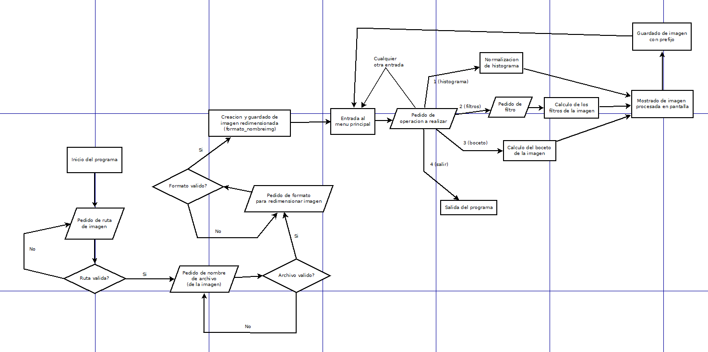

#  1er parte del Proyecto 2 de Python Avanzada: Procesamiento de imágenes

### Integrantes del grupo:
- Tadeo Angel Mion Griggio
- Tamara Abigail Rossi

Aquí tenemos el readme! Wow!

Las imágenes de prueba y las procesadas pueden encontrarse en las carpetas de:
- "imagenesPruebaBocetos"
- "imagenesPruebaFiltros"
- "imagenesPruebaHistograma"
- y "resultados testeo general" (que contiene imágenes generadas usando el menú del programa)

Aquí debería haber un diagrama de flujo del menú del programa...

